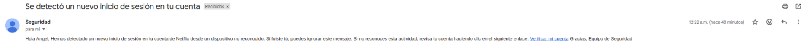
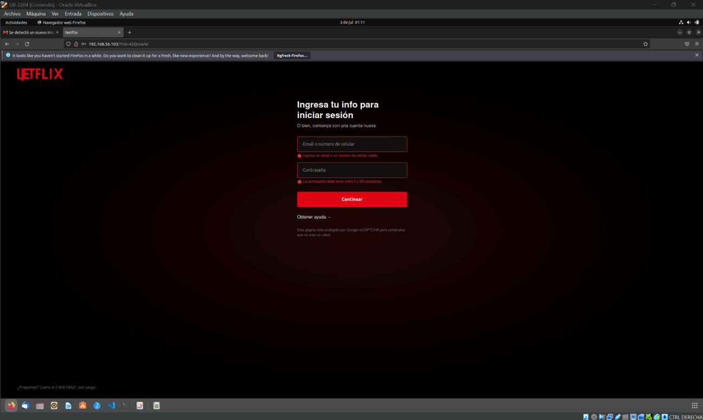
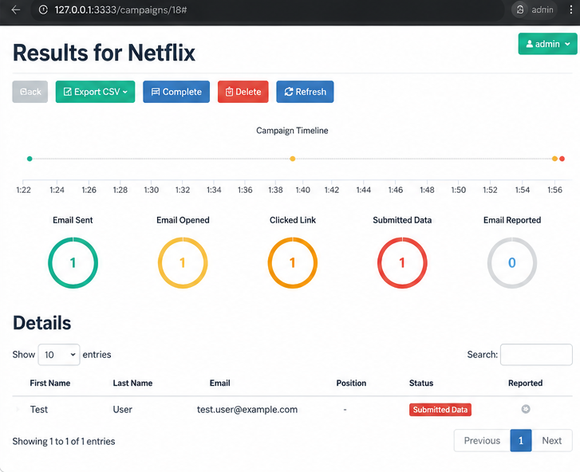
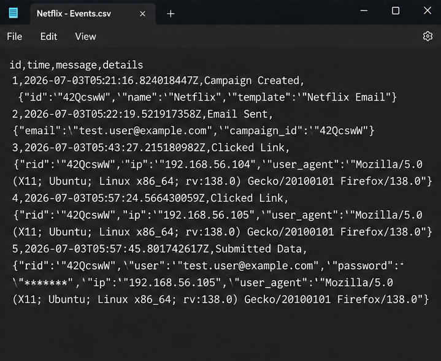

# 🎣 GoPhish Phishing Simulation Lab

Academic cybersecurity project focused on the simulation and analysis of a phishing campaign using **GoPhish** inside a controlled and isolated laboratory environment.

The objective of the project was to understand how phishing and social engineering attacks operate, evaluate user interaction with simulated phishing content, and analyze security measures that can help reduce these risks.

> ⚠️ **Ethical Use:** This project was developed exclusively for educational purposes in an authorized and controlled laboratory environment. No real credentials or unauthorized targets were used.

---

## 📌 Project Overview

This project was developed as a **team academic project at Universidad de Lima**.

I participated as a member of the project team in the design, implementation and analysis of a controlled phishing simulation.

The laboratory reproduced the basic workflow of a phishing campaign:

1. Configure the phishing simulation in GoPhish.
2. Send a controlled email to a test user.
3. Redirect the user to a simulated login page.
4. Record user interaction with the campaign.
5. Analyze the events generated by GoPhish.
6. Identify security risks and propose mitigation measures.

---

## 🎯 Objectives

The main objectives were to:

* Study phishing attacks and social engineering techniques.
* Build an isolated environment for safe phishing simulations.
* Configure GoPhish for controlled email campaigns.
* Create realistic phishing email templates.
* Configure simulated landing pages.
* Evaluate user interaction with phishing content.
* Analyze campaign events and reports.
* Identify human-related security risks.
* Propose security recommendations and mitigation measures.

---

## 🧪 Laboratory Environment

The project was implemented using virtual machines connected through an isolated laboratory network.

### Architecture

```text
┌──────────────────────────┐
│      Kali Linux VM       │
│                          │
│  GoPhish Server          │
│  Campaign Management     │
│  Landing Page            │
│  Event Collection        │
└────────────┬─────────────┘
             │
             │ Host-Only Network
             │
┌────────────▼─────────────┐
│       Ubuntu VM          │
│                          │
│  Test User               │
│  Email Reception         │
│  Browser Interaction     │
└──────────────────────────┘
```

The **Host-Only network** allowed communication between the virtual machines while keeping the laboratory isolated from external systems.

---

## 🛠️ Technologies & Tools

### Core Environment

* **GoPhish**
* **Kali Linux**
* **Ubuntu**
* **Oracle VirtualBox**

### Security & Network Tools

* **Wireshark**
* **Nmap**

### Other Technologies

* SMTP
* HTTP
* HTML
* Virtual Networking
* Linux

---

## ⚙️ Implementation

### 1. Environment Setup

A virtualized laboratory was created using **Oracle VirtualBox**.

Kali Linux was used as the main server environment, while Ubuntu represented the test workstation.

The virtual machines communicated through a **Host-Only network**, allowing the phishing simulation to remain isolated from external systems.

---

### 2. GoPhish Configuration

GoPhish was installed and configured on the Kali Linux machine.

The platform was used to manage:

* Test users
* Email templates
* Landing pages
* SMTP sending profiles
* Campaign parameters
* Campaign results

---

### 3. Simulated Phishing Email

A phishing email template was created to reproduce a realistic social engineering scenario.

The campaign simulated a security notification encouraging the test user to verify an account through a provided link.

The message was sent only to an authorized test account.

---

## 📧 Campaign Example



*Simulated phishing email used during the controlled laboratory exercise.*

---

### 4. Simulated Landing Page

The link contained in the email redirected the test user to a simulated login page hosted inside the laboratory.

The page reproduced the appearance of a real authentication portal exclusively for educational purposes.

---

## 🌐 Landing Page



*Simulated authentication page hosted inside the isolated laboratory environment.*

---

### 5. Campaign Execution

The controlled campaign followed this workflow:

```text
GoPhish Campaign
       │
       ▼
Simulated Email
       │
       ▼
Test User
       │
       ▼
Email Opened
       │
       ▼
Link Clicked
       │
       ▼
Simulated Landing Page
       │
       ▼
Test Data Submitted
       │
       ▼
GoPhish Event Log
       │
       ▼
Results Analysis
```

GoPhish recorded the interaction events generated throughout the simulation.

---

## 📊 Campaign Results

The simulation successfully demonstrated the complete phishing workflow.

The laboratory verified:

* Successful delivery of the simulated email.
* Successful access to the phishing link.
* Correct loading of the simulated landing page.
* Registration of test form submissions.
* Collection of campaign interaction events.
* Visualization of campaign statistics through GoPhish.

---

## 📈 GoPhish Dashboard



*GoPhish campaign dashboard showing the events generated during the controlled simulation.*

The platform allowed the team to monitor events such as:

* Emails sent
* Emails opened
* Links clicked
* Submitted test data
* Campaign timeline

---

## 📝 Event Analysis

Campaign events were also exported and reviewed to understand the sequence of user interactions.

Examples of recorded events included:

```text
Campaign Created
Email Sent
Email Opened
Clicked Link
Submitted Data
```

---

## 🔎 Event Logs



*Exported campaign events showing the interaction sequence recorded during the laboratory.*

---

## 🔐 Security Risks Identified

The project demonstrated how phishing attacks can exploit the **human factor** without necessarily requiring a technical vulnerability in the target system.

The analysis identified risks related to:

* Social engineering susceptibility
* Failure to verify suspicious links
* Difficulty identifying fraudulent emails
* Credential exposure through fake authentication pages
* Unauthorized account access
* Information leakage

---

## 🛡️ Recommended Security Controls

Several defensive measures were identified during the project.

### User Awareness

* Regular phishing awareness training
* Verification of email senders
* Validation of links before accessing them
* Security awareness programs

### Authentication

* Multi-Factor Authentication (**MFA**)
* Strong password practices
* Password managers

### Email Security

* **SPF**
* **DKIM**
* **DMARC**
* Anti-spam and anti-phishing filters

### Monitoring

* Continuous security monitoring
* Analysis of suspicious events
* Integration with SIEM platforms as a possible future improvement

---

## 🧠 Skills Practiced

This project provided practical exposure to:

* Cybersecurity
* Phishing Simulation
* Social Engineering
* GoPhish
* Kali Linux
* Linux
* VirtualBox
* Virtual Networking
* Security Awareness
* Event Analysis
* Security Risk Analysis
* Security Controls

---

## 🚀 Possible Future Improvements

Potential improvements identified during the project include:

* Creating additional social engineering scenarios
* Developing more complex simulation campaigns
* Integrating campaign events with a **SIEM**
* Automating campaign reports
* Expanding event monitoring and analysis
* Testing additional defensive controls

---

## ⚖️ Ethical Considerations

Phishing simulation tools can be useful for cybersecurity awareness and defensive training, but they must be used responsibly.

All activities in this project were performed:

* In an isolated laboratory
* With authorized test users
* Using test data
* For academic and educational purposes

Phishing campaigns should never be performed against individuals, organizations or systems without explicit authorization.

---

## 🎓 Academic Context

**Universidad de Lima**
Faculty of Engineering
Systems Engineering
Cybersecurity Course

**Project:**
*Phishing Attack Simulation using GoPhish for Vulnerability Assessment and Cybersecurity Awareness*

**Year:** 2026

---

## 👤 Contributor

**Rodrigo Borja**
Systems Engineering Student — Universidad de Lima

Interests:

* Cybersecurity
* Penetration Testing
* Web Security
* Security Operations (SOC)
* Information Security
